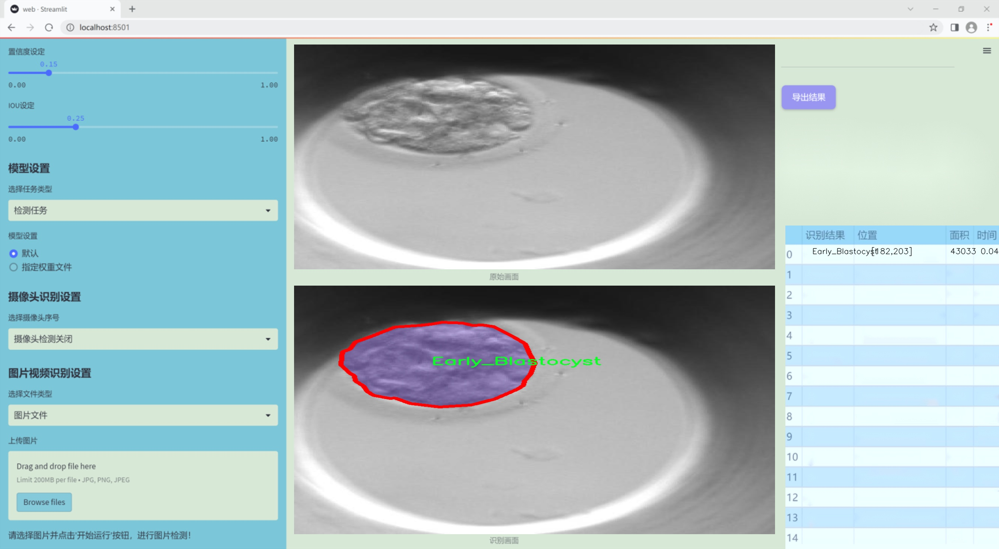
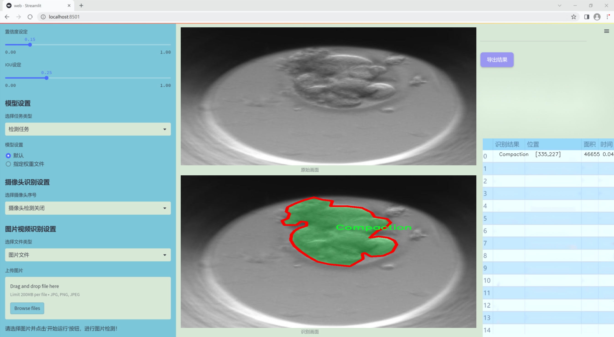
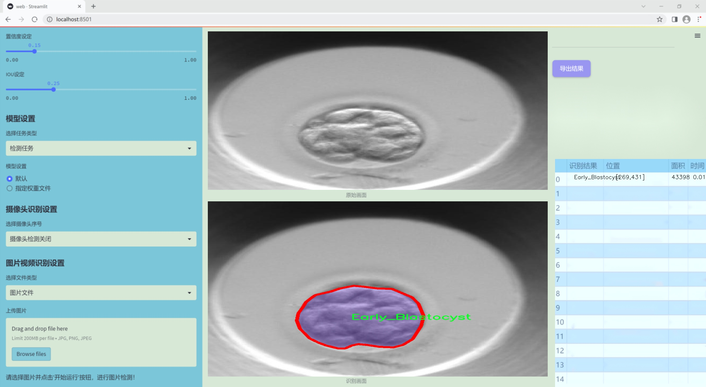
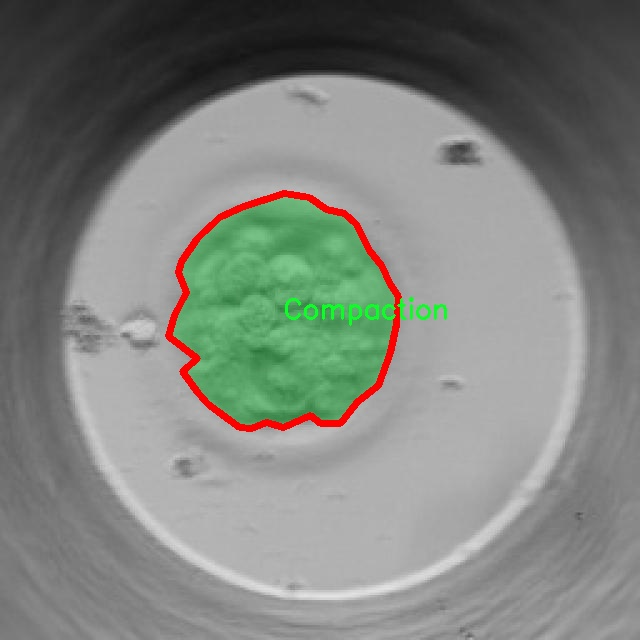
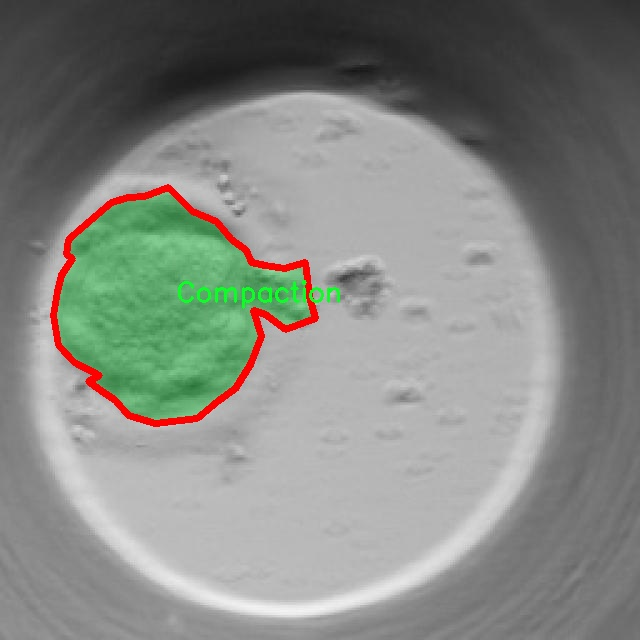
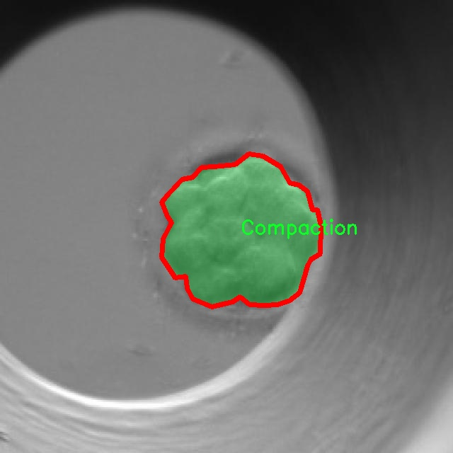
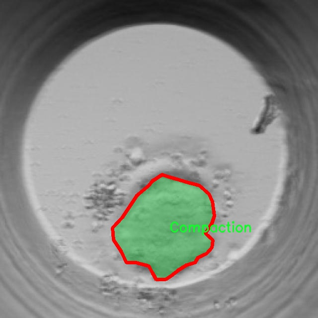
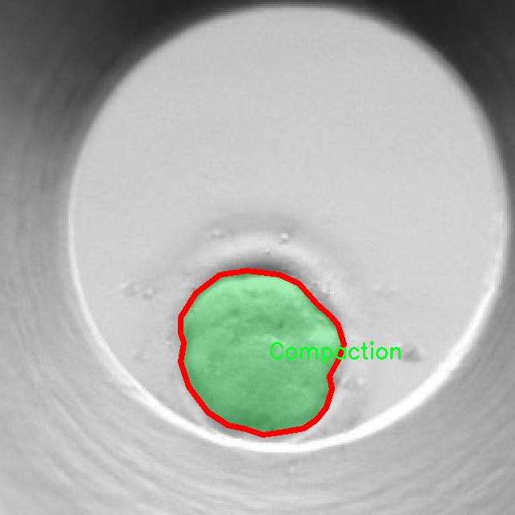

### 1.背景意义

研究背景与意义

在生物医学领域，胚胎发育阶段的检测与分析对于生殖医学、胚胎干细胞研究以及人类健康具有重要意义。随着辅助生殖技术的不断发展，如何准确、快速地识别和分类不同阶段的胚胎，成为了提高成功率和优化治疗方案的关键因素之一。传统的胚胎发育阶段检测方法多依赖于人工观察，存在主观性强、效率低下等问题。因此，基于计算机视觉的自动化检测系统应运而生，成为研究的热点。

本研究旨在开发一个基于改进YOLOv11的胚胎发育阶段检测系统，利用深度学习技术实现对胚胎发育阶段的高效识别。我们所使用的数据集包含9700幅图像，涵盖了14个不同的胚胎发育阶段类别，包括从“Compaction”到“tPNf”的多个阶段。这些数据为模型的训练和验证提供了丰富的样本，有助于提高模型的准确性和鲁棒性。

通过对胚胎发育阶段的自动检测，能够显著降低人工操作的时间成本，提高检测的准确性，从而为临床提供更为可靠的决策支持。此外，改进YOLOv11模型在处理实例分割任务时的性能，将为胚胎图像的细粒度分析提供新的可能性。这不仅能够推动生殖医学的进步，还可能为相关领域的研究提供重要的技术支持。

综上所述，基于改进YOLOv11的胚胎发育阶段检测系统的研究，不仅具有重要的理论价值，也具备广泛的应用前景，能够为生殖医学、胚胎学研究等领域提供强有力的技术支持，推动相关领域的科学进步。

### 2.视频效果

[2.1 视频效果](https://www.bilibili.com/video/BV1tnqrYcEe4/)

### 3.图片效果







##### [项目涉及的源码数据来源链接](https://kdocs.cn/l/cszuIiCKVNis)**

注意：本项目提供训练的数据集和训练教程,由于版本持续更新,暂不提供权重文件（best.pt）,请按照6.训练教程进行训练后实现上图演示的效果。

### 4.数据集信息

##### 4.1 本项目数据集类别数＆类别名

nc: 14
names: ['Compaction', 'Early_Blastocyst', 'Expanded_blast', 't2', 't3', 't4', 't5', 't6', 't7', 't8', 't9-', 'tB', 'tM', 'tPNf']


该项目为【图像分割】数据集，请在【训练教程和Web端加载模型教程（第三步）】这一步的时候按照【图像分割】部分的教程来训练

##### 4.2 本项目数据集信息介绍

本项目数据集信息介绍

本项目旨在改进YOLOv11的胚胎发育阶段检测系统，所使用的数据集专注于“Compaction Detection”，涵盖了胚胎发育过程中关键的阶段和状态。该数据集包含14个类别，具体类别包括：Compaction、Early_Blastocyst、Expanded_blast、t2、t3、t4、t5、t6、t7、t8、t9-、tB、tM和tPNf。这些类别代表了从胚胎的初始阶段到更为复杂的发育阶段的不同状态，反映了胚胎在早期发育过程中的重要变化。

数据集中“Compaction”类别标识了胚胎细胞在早期阶段的聚集现象，这是胚胎发育的一个重要标志，通常与细胞的分化和后续发育密切相关。紧接着是“Early_Blastocyst”类别，表示胚胎已经进入早期囊胚阶段，细胞开始形成内细胞团和外细胞层。随着发育的推进，数据集中的“Expanded_blast”类别则标识了囊胚的扩展状态，表明胚胎在发育过程中经历了显著的变化。

后续的类别如t2至t9-则代表了不同的发育阶段，每个阶段都具有独特的细胞特征和生物学意义。这些类别的划分不仅有助于研究人员理解胚胎发育的动态过程，也为临床应用提供了重要的参考依据。数据集中的“tB”、“tM”和“tPNf”类别则进一步细化了胚胎的发育状态，涵盖了不同的生物学特征和发育潜力。

通过使用这一丰富的数据集，改进后的YOLOv11系统将能够更准确地识别和分类胚胎的不同发育阶段，从而为胚胎研究和临床辅助生殖技术提供强有力的支持。这一数据集的构建和应用，旨在推动胚胎发育研究的深入发展，提升相关技术的准确性和可靠性。











### 5.全套项目环境部署视频教程（零基础手把手教学）

[5.1 所需软件PyCharm和Anaconda安装教程（第一步）](https://www.bilibili.com/video/BV1BoC1YCEKi/?spm_id_from=333.999.0.0&vd_source=bc9aec86d164b67a7004b996143742dc)


[5.2 安装Python虚拟环境创建和依赖库安装视频教程（第二步）](https://www.bilibili.com/video/BV1ZoC1YCEBw?spm_id_from=333.788.videopod.sections&vd_source=bc9aec86d164b67a7004b996143742dc)

### 6.改进YOLOv11训练教程和Web_UI前端加载模型教程（零基础手把手教学）

[6.1 改进YOLOv11训练教程和Web_UI前端加载模型教程（第三步）](https://www.bilibili.com/video/BV1BoC1YCEhR?spm_id_from=333.788.videopod.sections&vd_source=bc9aec86d164b67a7004b996143742dc)


按照上面的训练视频教程链接加载项目提供的数据集，运行train.py即可开始训练



     Epoch   gpu_mem       box       obj       cls    labels  img_size
     1/200     20.8G   0.01576   0.01955  0.007536        22      1280: 100%|██████████| 849/849 [14:42<00:00,  1.04s/it]
               Class     Images     Labels          P          R     mAP@.5 mAP@.5:.95: 100%|██████████| 213/213 [01:14<00:00,  2.87it/s]
                 all       3395      17314      0.994      0.957      0.0957      0.0843

     Epoch   gpu_mem       box       obj       cls    labels  img_size
     2/200     20.8G   0.01578   0.01923  0.007006        22      1280: 100%|██████████| 849/849 [14:44<00:00,  1.04s/it]
               Class     Images     Labels          P          R     mAP@.5 mAP@.5:.95: 100%|██████████| 213/213 [01:12<00:00,  2.95it/s]
                 all       3395      17314      0.996      0.956      0.0957      0.0845

     Epoch   gpu_mem       box       obj       cls    labels  img_size
     3/200     20.8G   0.01561    0.0191  0.006895        27      1280: 100%|██████████| 849/849 [10:56<00:00,  1.29it/s]
               Class     Images     Labels          P          R     mAP@.5 mAP@.5:.95: 100%|███████   | 187/213 [00:52<00:00,  4.04it/s]
                 all       3395      17314      0.996      0.957      0.0957      0.0845


###### [项目数据集下载链接](https://kdocs.cn/l/cszuIiCKVNis)

### 7.原始YOLOv11算法讲解


###### YOLOv11改进方向

与YOLOv 10相比，YOLOv 11有了巨大的改进，包括但不限于：

  * 增强的模型结构：模型具有改进的模型结构，以获取图像处理并形成预测
  * GPU优化：这是现代ML模型的反映，GPU训练ML模型在速度和准确性上都更好。
  * 速度：YOLOv 11模型现在经过增强和GPU优化以用于训练。通过优化，这些模型比它们的前版本快得多。在速度上达到了25%的延迟减少！
  * 更少的参数：更少的参数允许更快的模型，但v11的准确性不受影响
  * 更具适应性：更多支持的任务YOLOv 11支持多种类型的任务、多种类型的对象和多种类型的图像。

###### YOLOv11功能介绍

Glenn Jocher和他的团队制作了一个令人敬畏的YOLOv 11迭代，并且在图像人工智能的各个方面都提供了YOLO。YOLOv 11有多种型号，包括：

  * 对象检测-在训练时检测图像中的对象
  * 图像分割-超越对象检测，分割出图像中的对象
  * 姿态检测-当用点和线训练时绘制一个人的姿势
  * 定向检测（OBB）：类似于对象检测，但包围盒可以旋转
  * 图像分类-在训练时对图像进行分类

使用Ultralytics Library，这些模型还可以进行优化，以：

  * 跟踪-可以跟踪对象的路径
  * 易于导出-库可以以不同的格式和目的导出
  * 多场景-您可以针对不同的对象和图像训练模型

此外，Ultralytics还推出了YOLOv 11的企业模型，该模型将于10月31日发布。这将与开源的YOLOv
11模型并行，但将拥有更大的专有Ultralytics数据集。YOLOv 11是“建立在过去的成功”的其他版本的之上。

###### YOLOv11模型介绍

YOLOv 11附带了边界框模型（无后缀），实例分割（-seg），姿态估计（-pose），定向边界框（-obb）和分类（-cls）。

这些也有不同的尺寸：纳米（n），小（s），中（m），大（l），超大（x）。


YOLOv11模型

###### YOLOv11与前版本对比

与YOLOv10和YOLOv8相比，YOLOv11在Ultralytics的任何帖子中都没有直接提到。所以我会收集所有的数据来比较它们。感谢Ultralytics：

**检测：**


YOLOv11检测统计


YOLOv10检测统计

其中，Nano的mAPval在v11上为39.5，v10上为38.5；Small为47.0 vs 46.3，Medium为51.5 vs
51.1，Large为53.4 vs 53.2，Extra Large为54.7vs
54.4。现在，这可能看起来像是一种增量增加，但小小数的增加可能会对ML模型产生很大影响。总体而言，YOLOv11以0.3
mAPval的优势追平或击败YOLOv10。

现在，我们必须看看速度。在延迟方面，Nano在v11上为1.55 , v10上为1.84，Small为2.46 v2.49，Medium为4.70
v4.74，Large为6.16 v7.28，Extra Large为11.31
v10.70。延迟越低越好。YOLOv11提供了一个非常低的延迟相比，除了特大做得相当差的前身。

总的来说，Nano模型是令人振奋的，速度更快，性能相当。Extra Large在性能上有很好的提升，但它的延迟非常糟糕。

**分割：**


YOLOV11 分割统计


YOLOV9 分割统计


YOLOV8 分割数据

总体而言，YOLOv 11上的分割模型在大型和超大型模型方面比上一代YOLOv 8和YOLOv 9做得更好。

YOLOv 9 Segmentation没有提供任何关于延迟的统计数据。比较YOLOv 11延迟和YOLOv 8延迟，发现YOLOv 11比YOLOv
8快得多。YOLOv 11将大量GPU集成到他们的模型中，因此期望他们的模型甚至比CPU测试的基准更快！

姿态估计：


YOLOV11姿态估计统计


YOLOV8姿态估计统计

YOLOv 11的mAP 50 -95统计量也逐渐优于先前的YOLOv 8（除大型外）。然而，在速度方面，YOLOv
11姿势可以最大限度地减少延迟。其中一些延迟指标是版本的1/4！通过对这些模型进行GPU训练优化，我可以看到指标比显示的要好得多。

**定向边界框：**


YOLOv11 OBB统计


YOLOv8 OBB统计

OBB统计数据在mAP
50上并不是很好，只有非常小的改进，在某种程度上小于检测中的微小改进。然而，从v8到v11的速度减半，这表明YOLOv11在速度上做了很多努力。

**最后，分类：**


YOLOv 11 CLS统计


YOLOv8 CLS统计

从v8到v11，准确性也有了微小的提高。然而，速度大幅上升，CPU速度更快的型号。


### 8.200+种全套改进YOLOV11创新点原理讲解

#### 8.1 200+种全套改进YOLOV11创新点原理讲解大全

由于篇幅限制，每个创新点的具体原理讲解就不全部展开，具体见下列网址中的改进模块对应项目的技术原理博客网址【Blog】（创新点均为模块化搭建，原理适配YOLOv5~YOLOv11等各种版本）

[改进模块技术原理博客【Blog】网址链接](https://gitee.com/qunmasj/good)


#### 8.2 精选部分改进YOLOV11创新点原理讲解

###### 这里节选部分改进创新点展开原理讲解(完整的改进原理见上图和[改进模块技术原理博客链接](https://gitee.com/qunmasj/good)【如果此小节的图加载失败可以通过CSDN或者Github搜索该博客的标题访问原始博客，原始博客图片显示正常】

### 上下文引导网络（CGNet）简介


高准确率的模型（蓝点），由图像分类网络转化而来且参数量大，因此大多不适于移动设备。
低分辨率的小模型（红点），遵循分类网络的设计方式，忽略了分割特性，故而效果不好。
#### CGNet的设计：
为了提升准确率，用cgnet探索语义分割的固有属性。对于准确率的提升，因为语义分割是像素级分类和目标定位，所以空间依赖性和上下文信息发挥了重要作用。因此，设计cg模块，用于建模空间依赖性和语义上下文信息。
- 1、cg模块学习局部特征和周围特征形成联合特征
- 2、通过逐通道重新加权（强调有用信息，压缩无用信息），用全局特征改善联合特征
- 3、在全阶段应用cg模块，以便从语义层和空间层捕捉信息。
为了降低参数量：1、深层窄网络，尽可能节约内存 2、用通道卷积


之前的网络根据框架可分三类：
- 1、FCN-shape的模型，遵循分类网络的设计，忽略了上下文信息 ESPNet、ENet、fcn
- 2、FCN-CM模型，在编码阶段后用上下文模块捕捉语义级信息 DPC、DenseASPP、DFN、PSPNet
- 3、（our）在整个阶段捕捉上下文特征
- 4、主流分割网络的下采样为五次，学习了很多关于物体的抽象特征，丢失了很多有鉴别性的空间信息，导致分割边界过于平滑，（our）仅采用三次下采样，利于保存空间信息


#### cg模块

Cg模块：
思路：人类视觉系统依赖上下文信息理解场景。
如图3,a， 如若仅关注黄色框框，很难分辨，也就是说，仅关注局部特征不容易正确识别目标的类别。 然后，如果加入了目标周围的特征，即图3,b，就很容易识别正确，所以周围特征对于语义分割是很有帮助的。在此基础上，如果进一步用整个场景的特征加以辅助，将会有更高的程度去争正确分类黄色框框的物体，如图3,c所示。 故，周围上下文和全局上下文对于提升分割精度都是有帮助的。


实现：基于此，提出cg模块，利用局部特征，周围上下文以及全局上下文。如图3,d所示。该模块共包含两个阶段。

第一步，floc( ) 局部和 fsur( )周围函数分别学习对应特征。floc( )用3x3卷积从周围8个点提取特征，对应于黄色框框；同时fsur( )用感受野更大的3x3带孔卷积学习周围上下文，对应红色框框。然后fjoi( )是指将前两路特征concat之后经BN，PReLU。此一部分是cg模块的第一步。
对于模块的第二步，fglo( )用于提取全局特征，改善联合特征。受SENet启发，全局上下文被认为是一个加权向量，用于逐通道微调联合特征，以强调有用元素、压缩无用元素。在本论文中，fglo( )用GAP产生聚合上下文特征，然后用多层感知机进一步提取全局上下文。最后，使用一个尺度层对联合特征重新加权用提取的全局上下文。
残差连接有利于学习更复杂的特征以及便于训练时梯度反向传播。两个拟设计方案，LRL局部残差连接和GRL全局残差连接，实验证明（消融实验），GRL效果更好

#### CGNet网络


原则：深、瘦（deep and thin）以节省内存。层数少，通道数少，三个下采样。

Stage1，三个标准卷积层，分辨率变成原来的1/2

Stage2和stage3，分别堆叠M和N个cg模块。该两个阶段，第一层的输入是前一阶段第一个和最后一个block的结合（how结合）利于特征重用和特征传播。

将输入图像下采样到1/4和1/8分别输入到第2和3阶段。

最后，用1x1卷积层进行分割预测。

为进一步降低参数量，局部和周围特征提取器采用了逐通道卷积。之前有的工作在逐通道卷积后采用1x1卷积用以改善通道间的信息流动，本文消融实验显示效果不好，分析：因为cg模块中提取的局部和全局特征需要保持通道独立性，所以本论文不使用1*1卷积。


### 9.系统功能展示

图9.1.系统支持检测结果表格显示

  图9.2.系统支持置信度和IOU阈值手动调节

  图9.3.系统支持自定义加载权重文件best.pt(需要你通过步骤5中训练获得)

  图9.4.系统支持摄像头实时识别

  图9.5.系统支持图片识别

  图9.6.系统支持视频识别

  图9.7.系统支持识别结果文件自动保存

  图9.8.系统支持Excel导出检测结果数据


### 10. YOLOv11核心改进源码讲解

#### 10.1 dynamic_snake_conv.py

以下是对代码的核心部分进行提炼和详细注释的结果：

```python
import torch
import torch.nn as nn
from ..modules.conv import Conv

__all__ = ['DySnakeConv']

class DySnakeConv(nn.Module):
    def __init__(self, inc, ouc, k=3) -> None:
        """
        初始化 DySnakeConv 模块
        :param inc: 输入通道数
        :param ouc: 输出通道数
        :param k: 卷积核大小，默认为 3
        """
        super().__init__()
        
        # 定义标准卷积层
        self.conv_0 = Conv(inc, ouc, k)
        # 定义动态蛇形卷积，分别沿 x 和 y 方向
        self.conv_x = DSConv(inc, ouc, 0, k)  # 沿 x 方向的动态蛇形卷积
        self.conv_y = DSConv(inc, ouc, 1, k)  # 沿 y 方向的动态蛇形卷积
    
    def forward(self, x):
        """
        前向传播函数
        :param x: 输入特征图
        :return: 连接后的输出特征图
        """
        # 将三个卷积的输出在通道维度上连接
        return torch.cat([self.conv_0(x), self.conv_x(x), self.conv_y(x)], dim=1)

class DSConv(nn.Module):
    def __init__(self, in_ch, out_ch, morph, kernel_size=3, if_offset=True, extend_scope=1):
        """
        动态蛇形卷积的初始化
        :param in_ch: 输入通道数
        :param out_ch: 输出通道数
        :param morph: 卷积核的形态（0：沿 x 轴，1：沿 y 轴）
        :param kernel_size: 卷积核大小
        :param if_offset: 是否需要偏移
        :param extend_scope: 扩展范围
        """
        super(DSConv, self).__init__()
        # 学习可变形偏移的卷积层
        self.offset_conv = nn.Conv2d(in_ch, 2 * kernel_size, 3, padding=1)
        self.bn = nn.BatchNorm2d(2 * kernel_size)  # 批归一化
        self.kernel_size = kernel_size

        # 定义沿 x 和 y 方向的动态蛇形卷积
        self.dsc_conv_x = nn.Conv2d(
            in_ch,
            out_ch,
            kernel_size=(kernel_size, 1),
            stride=(kernel_size, 1),
            padding=0,
        )
        self.dsc_conv_y = nn.Conv2d(
            in_ch,
            out_ch,
            kernel_size=(1, kernel_size),
            stride=(1, kernel_size),
            padding=0,
        )

        self.gn = nn.GroupNorm(out_ch // 4, out_ch)  # 组归一化
        self.act = Conv.default_act  # 默认激活函数

        self.extend_scope = extend_scope
        self.morph = morph
        self.if_offset = if_offset

    def forward(self, f):
        """
        前向传播函数
        :param f: 输入特征图
        :return: 卷积后的特征图
        """
        # 计算偏移
        offset = self.offset_conv(f)
        offset = self.bn(offset)
        offset = torch.tanh(offset)  # 将偏移限制在 -1 到 1 之间

        # 获取输入特征图的形状
        input_shape = f.shape
        dsc = DSC(input_shape, self.kernel_size, self.extend_scope, self.morph)  # 创建 DSC 实例
        deformed_feature = dsc.deform_conv(f, offset, self.if_offset)  # 进行可变形卷积

        # 根据形态选择对应的卷积
        if self.morph == 0:
            x = self.dsc_conv_x(deformed_feature.type(f.dtype))
        else:
            x = self.dsc_conv_y(deformed_feature.type(f.dtype))

        x = self.gn(x)  # 归一化
        x = self.act(x)  # 激活
        return x

class DSC(object):
    def __init__(self, input_shape, kernel_size, extend_scope, morph):
        """
        动态蛇形卷积的核心类
        :param input_shape: 输入特征图的形状
        :param kernel_size: 卷积核大小
        :param extend_scope: 扩展范围
        :param morph: 卷积核的形态
        """
        self.num_points = kernel_size
        self.width = input_shape[2]
        self.height = input_shape[3]
        self.morph = morph
        self.extend_scope = extend_scope  # 偏移范围

        # 定义特征图的形状
        self.num_batch = input_shape[0]
        self.num_channels = input_shape[1]

    def deform_conv(self, input, offset, if_offset):
        """
        执行可变形卷积
        :param input: 输入特征图
        :param offset: 偏移量
        :param if_offset: 是否使用偏移
        :return: 变形后的特征图
        """
        # 计算坐标图
        y, x = self._coordinate_map_3D(offset, if_offset)
        # 进行双线性插值
        deformed_feature = self._bilinear_interpolate_3D(input, y, x)
        return deformed_feature

    def _coordinate_map_3D(self, offset, if_offset):
        """
        计算 3D 坐标图
        :param offset: 偏移量
        :param if_offset: 是否使用偏移
        :return: y 和 x 的坐标图
        """
        # 这里省略了具体实现，主要是根据偏移量计算出新的坐标
        pass

    def _bilinear_interpolate_3D(self, input_feature, y, x):
        """
        进行 3D 双线性插值
        :param input_feature: 输入特征图
        :param y: y 坐标
        :param x: x 坐标
        :return: 插值后的特征图
        """
        # 这里省略了具体实现，主要是根据坐标进行插值
        pass
```

### 代码分析：
1. **DySnakeConv 类**：该类是一个复合卷积层，包含标准卷积和两个动态蛇形卷积（分别沿 x 和 y 方向）。在前向传播中，它将这三种卷积的输出在通道维度上连接。

2. **DSConv 类**：这是动态蛇形卷积的实现，负责计算可变形卷积的偏移量，并根据偏移量进行卷积操作。它使用了可学习的偏移卷积和标准卷积。

3. **DSC 类**：这是实现可变形卷积的核心类，负责计算坐标图和进行双线性插值。通过偏移量计算出新的坐标，并对输入特征图进行插值，得到变形后的特征图。

以上是对代码的核心部分的提炼和详细注释，保留了主要的功能和结构。

这个文件 `dynamic_snake_conv.py` 实现了一个动态蛇形卷积（Dynamic Snake Convolution）的神经网络模块，主要用于处理图像数据。该模块由多个类组成，包括 `DySnakeConv` 和 `DSConv`，以及一个核心的 `DSC` 类。下面是对这些类及其功能的详细解释。

首先，`DySnakeConv` 类是整个动态蛇形卷积的主要接口。它继承自 `nn.Module`，在初始化时接收输入通道数 `inc`、输出通道数 `ouc` 和卷积核大小 `k`。在构造函数中，创建了三个卷积层：`conv_0` 是标准卷积，`conv_x` 和 `conv_y` 是动态蛇形卷积，分别沿着 x 轴和 y 轴进行操作。`forward` 方法将输入 `x` 传递给这三个卷积层，并将它们的输出在通道维度上进行拼接，形成最终的输出。

接下来是 `DSConv` 类，它实现了动态蛇形卷积的具体操作。该类同样继承自 `nn.Module`，在初始化时接收输入通道、输出通道、卷积核的形态（沿 x 轴或 y 轴）、卷积核大小、是否需要偏移以及扩展范围等参数。`DSConv` 的构造函数中定义了多个卷积层，包括用于学习偏移的卷积层 `offset_conv`，以及两个用于动态卷积的卷积层 `dsc_conv_x` 和 `dsc_conv_y`。此外，还包括批归一化层和激活函数。

在 `DSConv` 的 `forward` 方法中，首先通过 `offset_conv` 计算出偏移量，并进行批归一化。偏移量经过 `tanh` 函数处理后，范围被限制在 -1 到 1 之间。接着，创建一个 `DSC` 实例，并调用其 `deform_conv` 方法，进行动态卷积操作。根据卷积的形态（x 轴或 y 轴），选择相应的卷积层进行计算，并返回经过激活函数处理后的结果。

`DSC` 类是动态卷积的核心实现，负责计算坐标映射和双线性插值。它的构造函数接收输入形状、卷积核大小、扩展范围和形态等参数，并定义了一些用于计算的变量。在 `_coordinate_map_3D` 方法中，根据偏移量计算出新的坐标映射。该方法根据卷积核的形态（x 轴或 y 轴）生成相应的坐标网格，并考虑偏移量进行调整。

`_bilinear_interpolate_3D` 方法则实现了对输入特征图的双线性插值，生成变形后的特征图。它通过计算邻域内的8个网格位置的值，并根据计算出的权重进行加权求和，最终得到变形后的输出。

最后，`deform_conv` 方法将输入特征图和偏移量传入，调用坐标映射和双线性插值方法，返回经过变形的特征图。

总体而言，这个文件实现了一个复杂的动态卷积结构，能够根据输入数据的特征自适应地调整卷积核的位置，从而提高卷积操作的灵活性和表达能力。

#### 10.2 mamba_yolo.py

以下是经过简化和注释的核心代码部分：

```python
import torch
import torch.nn as nn
from einops import rearrange

class LayerNorm2d(nn.Module):
    """二维层归一化类"""
    def __init__(self, normalized_shape, eps=1e-6, elementwise_affine=True):
        super().__init__()
        # 初始化层归一化
        self.norm = nn.LayerNorm(normalized_shape, eps, elementwise_affine)

    def forward(self, x):
        # 将输入张量的维度从 (B, C, H, W) 转换为 (B, H, W, C)
        x = rearrange(x, 'b c h w -> b h w c').contiguous()
        # 应用层归一化
        x = self.norm(x)
        # 再次转换回 (B, C, H, W)
        x = rearrange(x, 'b h w c -> b c h w').contiguous()
        return x

class CrossScan(torch.autograd.Function):
    """交叉扫描功能"""
    @staticmethod
    def forward(ctx, x: torch.Tensor):
        B, C, H, W = x.shape
        ctx.shape = (B, C, H, W)
        # 创建一个新的张量，存储不同方向的特征
        xs = x.new_empty((B, 4, C, H * W))
        xs[:, 0] = x.flatten(2, 3)  # 原始方向
        xs[:, 1] = x.transpose(dim0=2, dim1=3).flatten(2, 3)  # 旋转90度
        xs[:, 2:4] = torch.flip(xs[:, 0:2], dims=[-1])  # 反转
        return xs

    @staticmethod
    def backward(ctx, ys: torch.Tensor):
        B, C, H, W = ctx.shape
        L = H * W
        # 反向传播时的计算
        ys = ys[:, 0:2] + ys[:, 2:4].flip(dims=[-1]).view(B, 2, -1, L)
        y = ys[:, 0] + ys[:, 1].view(B, -1, W, H).transpose(dim0=2, dim1=3).contiguous().view(B, -1, L)
        return y.view(B, -1, H, W)

class SelectiveScanCore(torch.autograd.Function):
    """选择性扫描核心功能"""
    @staticmethod
    @torch.cuda.amp.custom_fwd
    def forward(ctx, u, delta, A, B, C, D=None, delta_bias=None, delta_softplus=False, nrows=1, backnrows=1):
        # 确保输入张量是连续的
        if u.stride(-1) != 1:
            u = u.contiguous()
        if delta.stride(-1) != 1:
            delta = delta.contiguous()
        if D is not None and D.stride(-1) != 1:
            D = D.contiguous()
        if B.stride(-1) != 1:
            B = B.contiguous()
        if C.stride(-1) != 1:
            C = C.contiguous()
        
        # 保存上下文信息
        ctx.delta_softplus = delta_softplus
        ctx.backnrows = backnrows
        # 调用CUDA核心的前向函数
        out, x, *rest = selective_scan_cuda_core.fwd(u, delta, A, B, C, D, delta_bias, delta_softplus, 1)
        ctx.save_for_backward(u, delta, A, B, C, D, delta_bias, x)
        return out

    @staticmethod
    @torch.cuda.amp.custom_bwd
    def backward(ctx, dout, *args):
        u, delta, A, B, C, D, delta_bias, x = ctx.saved_tensors
        if dout.stride(-1) != 1:
            dout = dout.contiguous()
        # 调用CUDA核心的反向函数
        du, ddelta, dA, dB, dC, dD, ddelta_bias, *rest = selective_scan_cuda_core.bwd(
            u, delta, A, B, C, D, delta_bias, dout, x, ctx.delta_softplus, 1
        )
        return (du, ddelta, dA, dB, dC, dD, ddelta_bias, None, None, None, None)

class SS2D(nn.Module):
    """SS2D模块，包含选择性扫描的实现"""
    def __init__(self, d_model=96, d_state=16, ssm_ratio=2.0, act_layer=nn.SiLU, dropout=0.0):
        super().__init__()
        self.in_proj = nn.Conv2d(d_model, d_model * ssm_ratio, kernel_size=1)
        self.out_proj = nn.Conv2d(d_model * ssm_ratio, d_model, kernel_size=1)
        self.dropout = nn.Dropout(dropout)
        self.act = act_layer()

    def forward(self, x: torch.Tensor):
        x = self.in_proj(x)  # 输入投影
        x = self.act(x)  # 激活函数
        x = self.dropout(x)  # Dropout
        x = self.out_proj(x)  # 输出投影
        return x

class VSSBlock_YOLO(nn.Module):
    """YOLO模型中的VSS块"""
    def __init__(self, in_channels: int, hidden_dim: int, drop_path: float = 0):
        super().__init__()
        self.proj_conv = nn.Conv2d(in_channels, hidden_dim, kernel_size=1)
        self.ss2d = SS2D(d_model=hidden_dim)
        self.drop_path = nn.Dropout(drop_path)

    def forward(self, input: torch.Tensor):
        input = self.proj_conv(input)  # 投影
        x = self.ss2d(input)  # 选择性扫描
        x = self.drop_path(x)  # Dropout
        return x
```

### 代码注释说明
1. **LayerNorm2d**: 实现了二维层归一化，适用于图像数据。
2. **CrossScan**: 处理输入张量，生成不同方向的特征，支持前向和反向传播。
3. **SelectiveScanCore**: 实现选择性扫描的核心功能，包含前向和反向传播的逻辑。
4. **SS2D**: 实现选择性扫描的模块，包含输入和输出的卷积层以及激活函数。
5. **VSSBlock_YOLO**: YOLO模型中的一个块，负责特征的投影和选择性扫描。

以上代码是核心部分，保留了主要功能并进行了详细注释。

这个程序文件 `mamba_yolo.py` 是一个用于实现 YOLO（You Only Look Once）目标检测模型的 PyTorch 代码。它包含了一些深度学习模型的基本组件和自定义的层，主要用于处理图像数据。以下是对代码的详细讲解。

首先，文件导入了一些必要的库，包括 `torch` 和 `torch.nn`，以及一些其他的工具函数和模块，如 `einops` 和 `timm.layers`。这些库提供了深度学习所需的基本功能，如张量操作、神经网络层的构建等。

接下来，定义了一个 `LayerNorm2d` 类，它是一个二维层归一化的实现。这个类的 `forward` 方法将输入张量的形状从 `(B, C, H, W)` 转换为 `(B, H, W, C)`，进行归一化后再转换回原来的形状。这种归一化方式在处理图像数据时非常常见。

然后，定义了一个 `autopad` 函数，用于自动计算卷积操作的填充，以确保输出的形状与输入相同。

接下来的部分实现了一些自定义的 PyTorch 函数和模块，如 `CrossScan` 和 `CrossMerge`，这些都是为了实现特定的操作，如交叉扫描和合并。它们的 `forward` 和 `backward` 方法实现了前向传播和反向传播的逻辑，适用于自定义的计算图。

`SelectiveScanCore` 类是一个自定义的自动求导函数，主要用于实现选择性扫描操作。这个操作在某些深度学习模型中用于高效地处理数据，尤其是在处理长序列时。它的 `forward` 和 `backward` 方法实现了选择性扫描的前向和反向计算。

`cross_selective_scan` 函数是一个高层次的接口，用于调用 `SelectiveScanCore` 进行选择性扫描。它接收多个参数，包括输入张量、权重和偏置等，并返回经过处理的输出张量。

接下来，定义了多个神经网络模块，包括 `SS2D`、`RGBlock`、`LSBlock`、`XSSBlock` 和 `VSSBlock_YOLO`。这些模块实现了不同的功能，如卷积操作、残差连接、前馈网络等。每个模块都有自己的初始化方法和前向传播逻辑，允许用户根据需要构建复杂的网络结构。

`SimpleStem` 类是一个简单的卷积网络，用于将输入图像转换为嵌入表示。它包含多个卷积层和激活函数，逐步提取特征。

`VisionClueMerge` 类则是一个特征融合模块，用于将不同来源的特征图合并。它通过对输入特征图进行下采样和卷积操作，生成最终的输出。

总的来说，这个文件实现了 YOLO 模型的多个组件，提供了灵活的模块化设计，允许用户根据具体需求进行调整和扩展。代码中使用了许多现代深度学习的技巧，如选择性扫描、残差连接和层归一化等，旨在提高模型的性能和效率。

#### 10.3 val.py

以下是经过简化并添加详细中文注释的核心代码部分：

```python
import os
import torch
from ultralytics.engine.validator import BaseValidator
from ultralytics.utils.metrics import DetMetrics, box_iou
from ultralytics.utils import LOGGER, ops

class DetectionValidator(BaseValidator):
    """
    基于检测模型的验证器类，继承自BaseValidator类。
    """

    def __init__(self, dataloader=None, save_dir=None, args=None):
        """初始化检测模型所需的变量和设置。"""
        super().__init__(dataloader, save_dir, args=args)
        self.metrics = DetMetrics(save_dir=self.save_dir)  # 初始化检测指标
        self.iouv = torch.linspace(0.5, 0.95, 10)  # 定义IOU向量，用于计算mAP

    def preprocess(self, batch):
        """对图像批次进行预处理，以便于YOLO训练。"""
        batch["img"] = batch["img"].to(self.device, non_blocking=True)  # 将图像转移到设备上
        batch["img"] = batch["img"].float() / 255  # 将图像归一化到[0, 1]范围
        for k in ["batch_idx", "cls", "bboxes"]:
            batch[k] = batch[k].to(self.device)  # 将其他数据转移到设备上
        return batch

    def postprocess(self, preds):
        """对预测输出应用非极大值抑制（NMS）。"""
        return ops.non_max_suppression(
            preds,
            self.args.conf,
            self.args.iou,
            multi_label=True,
            max_det=self.args.max_det,
        )

    def update_metrics(self, preds, batch):
        """更新检测指标。"""
        for si, pred in enumerate(preds):
            npr = len(pred)  # 当前预测的数量
            pbatch = self._prepare_batch(si, batch)  # 准备当前批次的真实标签
            cls, bbox = pbatch.pop("cls"), pbatch.pop("bbox")  # 获取真实标签的类别和边界框

            if npr == 0:  # 如果没有预测
                continue

            predn = self._prepare_pred(pred, pbatch)  # 准备预测数据
            stat = {
                "conf": predn[:, 4],  # 置信度
                "pred_cls": predn[:, 5],  # 预测类别
                "tp": self._process_batch(predn, bbox, cls)  # 计算真正例
            }
            self.metrics.process(**stat)  # 更新指标

    def _process_batch(self, detections, gt_bboxes, gt_cls):
        """
        返回正确的预测矩阵。
        """
        iou = box_iou(gt_bboxes, detections[:, :4])  # 计算IOU
        return self.match_predictions(detections[:, 5], gt_cls, iou)  # 匹配预测与真实标签

    def get_stats(self):
        """返回指标统计信息和结果字典。"""
        stats = self.metrics.results_dict  # 获取结果字典
        return stats

    def print_results(self):
        """打印每个类别的训练/验证集指标。"""
        pf = "%22s" + "%11i" * 2 + "%11.3g" * len(self.metrics.keys)  # 打印格式
        LOGGER.info(pf % ("all", self.seen, *self.metrics.mean_results()))  # 打印总体结果
```

### 代码说明：
1. **DetectionValidator类**：这是一个用于验证YOLO模型的类，继承自`BaseValidator`，主要负责处理验证过程中的数据预处理、指标更新和结果打印等功能。
   
2. **__init__方法**：初始化检测指标和IOU向量，为后续的验证过程做准备。

3. **preprocess方法**：对输入的图像批次进行预处理，包括将图像转移到设备上并进行归一化。

4. **postprocess方法**：对模型的预测结果应用非极大值抑制（NMS），以去除冗余的预测框。

5. **update_metrics方法**：更新检测指标，计算每个预测的置信度和类别，并与真实标签进行比较，更新真正例（TP）。

6. **_process_batch方法**：计算预测框与真实框之间的IOU，并返回匹配的预测结果。

7. **get_stats方法**：获取当前的指标统计信息和结果字典。

8. **print_results方法**：打印每个类别的验证结果，包括总体的检测指标。

这个程序文件 `val.py` 是一个用于目标检测模型验证的类，名为 `DetectionValidator`，它继承自 `BaseValidator` 类。这个类主要用于处理目标检测任务中的验证过程，包含数据预处理、指标计算、结果输出等功能。

在初始化时，`DetectionValidator` 类接收一些参数，如数据加载器、保存目录、进度条、参数字典等。它还设置了一些特定的变量，例如目标类别数量、是否使用 COCO 数据集、类别映射等。它的主要任务是进行目标检测模型的验证，并计算相关的性能指标。

`preprocess` 方法用于对输入的图像批次进行预处理，包括将图像转换为适合模型输入的格式，以及将边界框坐标调整为适当的比例。这个方法还会根据设置决定是否进行自动标注。

`init_metrics` 方法初始化评估指标，包括验证路径、类别映射、混淆矩阵等。它还会根据模型的类别名称设置相关的指标。

`get_desc` 方法返回一个格式化的字符串，用于描述每个类别的指标信息。

`postprocess` 方法应用非极大值抑制（NMS）来处理模型的预测输出，以减少重叠的边界框。

`_prepare_batch` 和 `_prepare_pred` 方法分别用于准备输入的图像和标签数据，以及处理模型的预测结果，以便后续的指标计算。

`update_metrics` 方法用于更新验证过程中计算的指标，包括正确预测的数量、置信度、预测类别等信息。它还会根据需要保存预测结果到 JSON 或 TXT 文件中。

`finalize_metrics` 方法设置最终的指标值，包括计算速度和混淆矩阵。

`get_stats` 方法返回指标统计信息和结果字典，方便后续的结果输出和分析。

`print_results` 方法用于打印训练或验证集的每个类别的指标，包括总的检测数量和每个类别的平均结果。

`_process_batch` 方法计算正确预测的矩阵，通过计算预测框与真实框之间的交并比（IoU）来评估预测的准确性。

`build_dataset` 和 `get_dataloader` 方法用于构建 YOLO 数据集和返回数据加载器，以便在验证过程中使用。

`plot_val_samples` 和 `plot_predictions` 方法用于可视化验证样本和模型的预测结果，生成相应的图像文件。

`save_one_txt` 和 `pred_to_json` 方法用于将模型的检测结果保存为特定格式的文件，方便后续分析和评估。

`eval_json` 方法用于评估 YOLO 输出的 JSON 格式结果，并返回性能统计信息，支持与 COCO 数据集的评估。

整体来看，这个程序文件提供了一个完整的框架，用于验证目标检测模型的性能，计算各种指标，并可视化和保存结果，适用于使用 YOLO 模型进行目标检测的场景。

#### 10.4 wtconv2d.py

以下是代码中最核心的部分，并附上详细的中文注释：

```python
import torch
import torch.nn as nn
import torch.nn.functional as F
from torch.autograd import Function
import pywt

# 创建小波滤波器
def create_wavelet_filter(wave, in_size, out_size, type=torch.float):
    # 使用pywt库创建小波对象
    w = pywt.Wavelet(wave)
    
    # 反转小波的分解高通和低通滤波器
    dec_hi = torch.tensor(w.dec_hi[::-1], dtype=type)
    dec_lo = torch.tensor(w.dec_lo[::-1], dtype=type)
    
    # 创建分解滤波器
    dec_filters = torch.stack([
        dec_lo.unsqueeze(0) * dec_lo.unsqueeze(1),
        dec_lo.unsqueeze(0) * dec_hi.unsqueeze(1),
        dec_hi.unsqueeze(0) * dec_lo.unsqueeze(1),
        dec_hi.unsqueeze(0) * dec_hi.unsqueeze(1)
    ], dim=0)

    # 扩展滤波器以适应输入通道数
    dec_filters = dec_filters[:, None].repeat(in_size, 1, 1, 1)

    # 反转小波的重构高通和低通滤波器
    rec_hi = torch.tensor(w.rec_hi[::-1], dtype=type).flip(dims=[0])
    rec_lo = torch.tensor(w.rec_lo[::-1], dtype=type).flip(dims=[0])
    
    # 创建重构滤波器
    rec_filters = torch.stack([
        rec_lo.unsqueeze(0) * rec_lo.unsqueeze(1),
        rec_lo.unsqueeze(0) * rec_hi.unsqueeze(1),
        rec_hi.unsqueeze(0) * rec_lo.unsqueeze(1),
        rec_hi.unsqueeze(0) * rec_hi.unsqueeze(1)
    ], dim=0)

    # 扩展滤波器以适应输出通道数
    rec_filters = rec_filters[:, None].repeat(out_size, 1, 1, 1)

    return dec_filters, rec_filters

# 小波变换
def wavelet_transform(x, filters):
    b, c, h, w = x.shape  # 获取输入的形状
    pad = (filters.shape[2] // 2 - 1, filters.shape[3] // 2 - 1)  # 计算填充
    # 使用卷积进行小波变换
    x = F.conv2d(x, filters.to(x.dtype).to(x.device), stride=2, groups=c, padding=pad)
    x = x.reshape(b, c, 4, h // 2, w // 2)  # 重塑输出形状
    return x

# 反小波变换
def inverse_wavelet_transform(x, filters):
    b, c, _, h_half, w_half = x.shape  # 获取输入的形状
    pad = (filters.shape[2] // 2 - 1, filters.shape[3] // 2 - 1)  # 计算填充
    x = x.reshape(b, c * 4, h_half, w_half)  # 重塑输入形状
    # 使用转置卷积进行反小波变换
    x = F.conv_transpose2d(x, filters.to(x.dtype).to(x.device), stride=2, groups=c, padding=pad)
    return x

# 定义小波变换的类
class WaveletTransform(Function):
    @staticmethod
    def forward(ctx, input, filters):
        ctx.filters = filters  # 保存滤波器
        with torch.no_grad():
            x = wavelet_transform(input, filters)  # 执行小波变换
        return x

    @staticmethod
    def backward(ctx, grad_output):
        grad = inverse_wavelet_transform(grad_output, ctx.filters)  # 计算反向传播
        return grad, None

# 定义WTConv2d类
class WTConv2d(nn.Module):
    def __init__(self, in_channels, out_channels, kernel_size=5, stride=1, bias=True, wt_levels=1, wt_type='db1'):
        super(WTConv2d, self).__init__()

        assert in_channels == out_channels  # 输入通道数必须等于输出通道数

        self.in_channels = in_channels
        self.wt_levels = wt_levels
        self.stride = stride

        # 创建小波滤波器
        self.wt_filter, self.iwt_filter = create_wavelet_filter(wt_type, in_channels, in_channels, torch.float)
        self.wt_filter = nn.Parameter(self.wt_filter, requires_grad=False)  # 不需要梯度
        self.iwt_filter = nn.Parameter(self.iwt_filter, requires_grad=False)  # 不需要梯度

        # 定义小波变换和反小波变换的函数
        self.wt_function = wavelet_transform_init(self.wt_filter)
        self.iwt_function = inverse_wavelet_transform_init(self.iwt_filter)

        # 基础卷积层
        self.base_conv = nn.Conv2d(in_channels, in_channels, kernel_size, padding='same', stride=1, groups=in_channels, bias=bias)

    def forward(self, x):
        # 执行小波变换和卷积操作
        # 省略具体实现细节
        return x  # 返回处理后的结果
```

### 代码核心部分解释：
1. **创建小波滤波器**：`create_wavelet_filter` 函数生成小波变换和反变换所需的滤波器。
2. **小波变换与反变换**：`wavelet_transform` 和 `inverse_wavelet_transform` 函数分别实现小波变换和反小波变换的过程。
3. **自定义小波变换类**：`WaveletTransform` 类使用 PyTorch 的 `Function` 机制实现前向和反向传播。
4. **小波卷积层**：`WTConv2d` 类是一个卷积层，结合了小波变换的特性，用于处理输入数据。

这个程序文件`wtconv2d.py`实现了一个基于小波变换的二维卷积层，主要用于深度学习中的图像处理任务。文件中包含多个函数和类，具体功能如下：

首先，导入了必要的库，包括PyTorch和PyWavelets。PyTorch用于构建神经网络和进行张量运算，而PyWavelets用于处理小波变换。

接下来，定义了一个`create_wavelet_filter`函数，该函数用于创建小波变换的滤波器。它接受小波类型、输入通道数和输出通道数作为参数，并返回用于小波分解和重构的滤波器。该函数使用PyWavelets库生成小波的高通和低通滤波器，并将其转换为PyTorch张量。

`wavelet_transform`和`inverse_wavelet_transform`函数分别实现了小波变换和逆小波变换。小波变换通过对输入张量进行卷积操作来提取特征，而逆小波变换则通过转置卷积将特征重构回原始空间。

接下来，定义了两个类`WaveletTransform`和`InverseWaveletTransform`，它们继承自`Function`类。`WaveletTransform`类实现了小波变换的前向和反向传播，`InverseWaveletTransform`类实现了逆小波变换的前向和反向传播。这些类的设计使得小波变换可以在神经网络中进行自动求导。

`wavelet_transform_init`和`inverse_wavelet_transform_init`函数用于初始化小波变换和逆小波变换的应用函数，这些函数会在后续的卷积操作中被调用。

`WTConv2d`类是文件的核心部分，继承自`nn.Module`。它实现了一个自定义的卷积层，结合了小波变换和常规卷积操作。在初始化时，该类会创建小波滤波器、基础卷积层和小波卷积层。小波卷积层的数量由`wt_levels`参数决定，表示小波变换的层数。

在`forward`方法中，输入张量经过小波变换、卷积操作和逆小波变换，最终输出结果。该方法首先对输入进行小波变换，然后通过多个小波卷积层处理特征，最后将处理后的特征通过逆小波变换重构回原始空间。

最后，定义了一个`_ScaleModule`类，用于对输入进行缩放操作。这个模块包含一个可学习的权重参数，用于调整输出的幅度。

总体而言，这个程序文件实现了一个结合小波变换的卷积神经网络层，能够在图像处理任务中提取多尺度特征，并通过小波变换的方式提高模型的表现。

### 11.完整训练+Web前端界面+200+种全套创新点源码、数据集获取


# [下载链接：https://mbd.pub/o/bread/Z5yYm59s](https://mbd.pub/o/bread/Z5yYm59s)